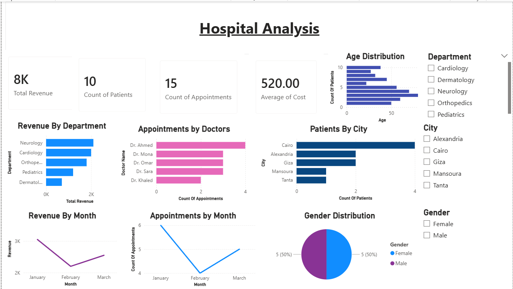
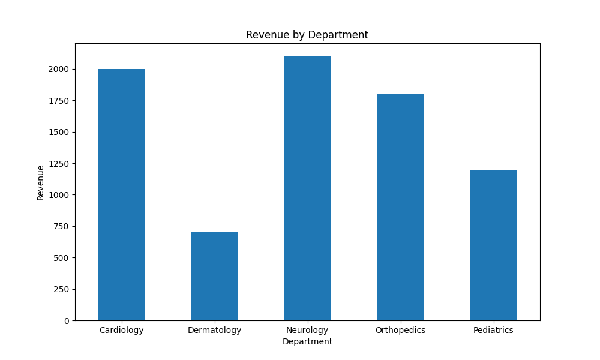
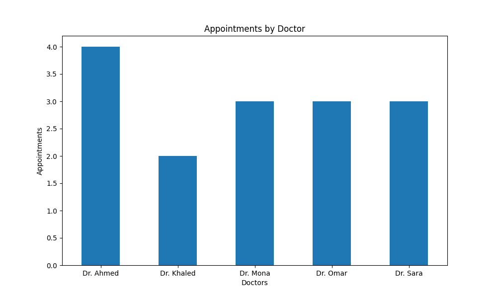
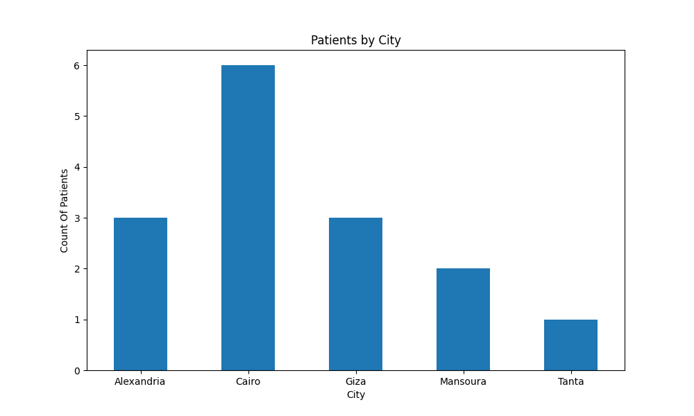
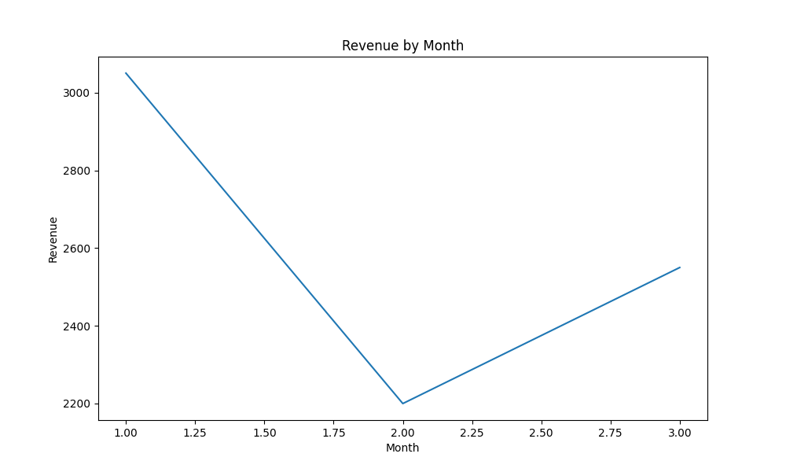
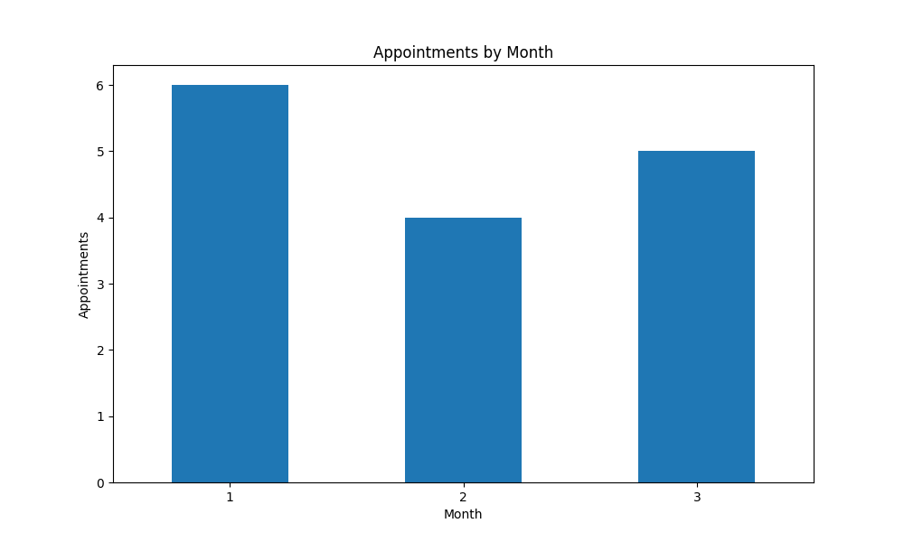
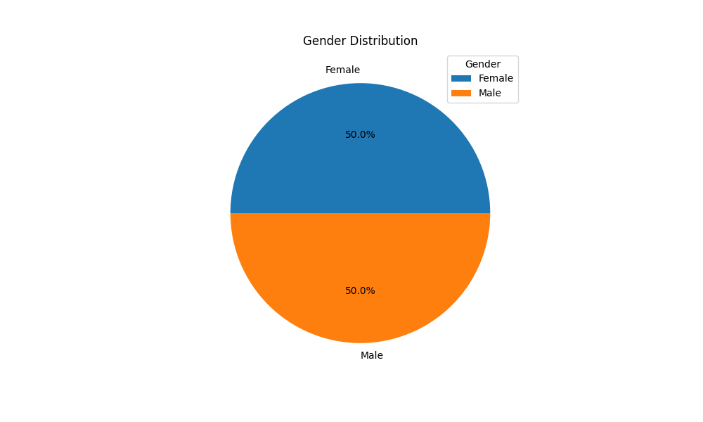
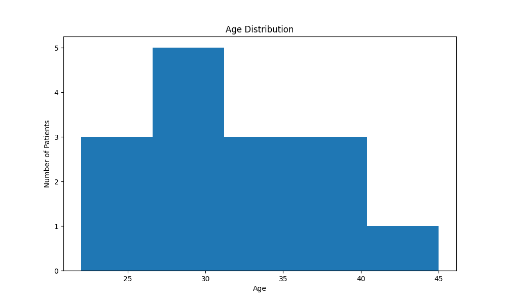

# Hospital-Analysis-Dashboard
# 🏥 Hospital Analysis Dashboard

## 📌 Project Overview

This project analyzes hospital operations using MySQL, Python, Pandas, Matplotlib, Excel, and Power BI.

The goal of this project is to transform raw hospital data into meaningful insights through data analysis and interactive dashboarding.

---

## 🛠 Technologies Used

* MySQL
* Python
* Pandas
* NumPy
* Matplotlib
* Excel
* Power BI

---

## 🗄 Database Structure

The project uses three relational tables:

### Patients

* Patient_ID
* Patient_Name
* Age
* Gender
* City

### Doctors

* Doctor_ID
* Doctor_Name
* Department

### Appointments

* Appointment_ID
* Patient_ID
* Doctor_ID
* Appointment_Date
* Cost

---

## 📊 Analysis Performed

### SQL Analysis

* Total Revenue
* Total Patients
* Total Doctors
* Total Appointments
* Average Appointment Cost
* Maximum Appointment Cost
* Revenue by Department
* Appointments by Department
* Appointments by Doctor

### Python Analysis

* Data Extraction from MySQL
* Data Cleaning
* Data Validation
* Data Merging
* Exploratory Data Analysis (EDA)
* KPI Calculation
* Data Visualization

---

## 📈 Dashboard Features

### KPIs

* Total Revenue
* Total Patients
* Total Appointments
* Average Appointment Cost

### Visualizations

* Revenue by Department
* Appointments by Doctor
* Patients by City
* Revenue by Month
* Appointments by Month
* Gender Distribution
* Age Distribution

### Interactive Filters

* Department Filter
* City Filter
* Gender Filter

---

## 🎯 Key Insights

* Analyze department performance based on revenue.
* Identify doctors with the highest number of appointments.
* Understand patient distribution across cities.
* Track monthly revenue and appointment trends.
* Explore patient demographics by age and gender.

---

## 📷 Dashboard Preview

---

# 📷 Visualizations

## Revenue by Department
Shows total revenue generated by each hospital department.

---

## Appointments by Doctor
Displays the number of appointments handled by each doctor.

---

## Patients by City
Illustrates the distribution of patients across different cities.

---

## Revenue by Month
Tracks monthly revenue trends over the analyzed period.

---

## Appointments by Month
Shows the number of appointments scheduled each month.

---

## Gender Distribution
Visualizes the percentage of male and female patients.

---

## Age Distribution
Displays the age distribution of patients.

## 🚀 Skills Demonstrated

* SQL Querying
* Database Management
* Data Cleaning
* Data Analysis
* Data Visualization
* Dashboard Development
* Business Intelligence
* Power BI Reporting

---

## 👨‍💻 Author

Omar Ahmed

Data Analyst | SQL | Python | Pandas | Power BI | Excel
